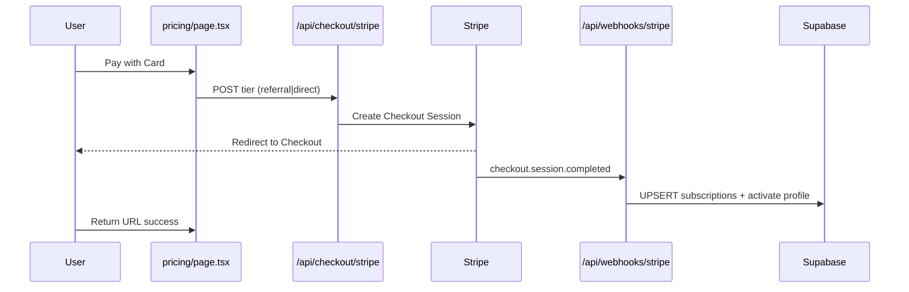
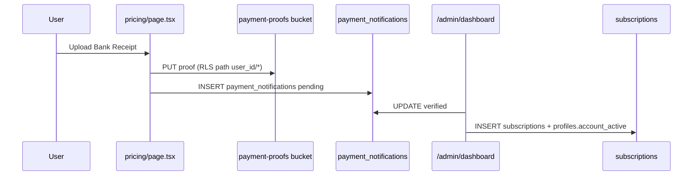

# Hybrid Billing (Stripe + Manual Bank Transfer) — Feature Constitution

**Feature:** Monetization — Stripe + Manual Hybrid Billing  
**Branch:** `001-phase-c-monetization`  
**Directory:** `.specify/monetization-stripe-hybrid/`  
**Project:** International Rishta (Next.js 15 + Supabase)  
**Version:** 1.0.0 | **Ratified:** 2026-06-29 | **Last Amended:** 2026-06-29

This document is the **Laws of this Feature**. All spec, plan, and implementation work for hybrid
billing MUST comply. It extends Phase C in `docs/initial-development-doc-001.md` and unifies
existing manual payment admin flows (`COMPLETE_PAYMENT_ADMIN_MIGRATION.sql`) with Stripe
Checkout subscriptions.

---

## 1. Feature Boundary

### 1.1 In scope

- **Stripe path:** Premium subscription via Stripe Checkout (card); webhook-driven activation.
- **Manual path:** Bank transfer proof upload (image/PDF) → `payment_notifications` → admin
  verification → subscription activation (existing admin dashboard).
- **Unified ledger:** One `public.subscriptions` row per billing period regardless of channel.
- **Pricing UI:** `src/app/[locale]/pricing/page.tsx` exposes both **Pay with Card** and
  **Upload Bank Receipt** without separate routes.
- Profile flags: `account_active`, `subscription_tier`, `subscription_status` (profiles +
  subscriptions tables).

### 1.2 Out of scope (deferred)

- JazzCash/Raast automated webhooks (manual proof only for bank transfer MVP).
- Stripe Customer Portal / self-serve cancel (future; webhook handles `deleted`).
- Bureau commission payout automation changes (reuse existing commission fields).
- Mobile in-app purchases.
- Refunds/disputes UI (Stripe Dashboard + admin notes only).

### 1.3 Product pricing (reference)

| Tier | PKR/month | Source |
|------|-----------|--------|
| Bureau referral | 3,999 | README / dev doc |
| Direct | 4,999 | README / dev doc |

Stripe `price_id` values MUST map to these tiers in configuration — never hardcode in UI.

---

## 2. Data Model Laws — Unified `public.subscriptions`

Base schema: `supabase/schema.sql`. Payment profile fields: `COMPLETE_PAYMENT_ADMIN_MIGRATION.sql`.
This feature **extends** `subscriptions` via migration — do not fork billing into a new table.

### 2.1 Required columns (existing + new)

| Column | Type | Rule |
|--------|------|------|
| `id` | uuid PK | Server-generated |
| `user_id` | uuid FK → profiles | Owner |
| `tier` | text | `referral` \| `direct` (existing check) |
| `amount` | numeric(10,2) | PKR amount at purchase time |
| `period_start` | timestamptz | Billing period start |
| `period_end` | timestamptz | Billing period end |
| `paid` | boolean | `true` when entitlement active for period |
| `paid_at` | timestamptz | Activation timestamp |
| `payment_method` | text | `stripe` \| `raast` \| `hbl` \| `manual` |
| `payment_reference` | text | Stripe session id OR bank txn id |
| **source_channel** | text | **NEW** — `stripe` \| `manual` (mutually exclusive) |
| **stripe_customer_id** | text | **NEW** — set when `source_channel = stripe` |
| **stripe_subscription_id** | text | **NEW** — Stripe sub id |
| **price_id** | text | **NEW** — Stripe Price id used at checkout |
| **payment_notification_id** | uuid | **NEW** — FK → `payment_notifications.id` when manual |
| **admin_approved_by** | uuid | **NEW** — FK → `admin_users.id` when manual verified |
| `bureau_id` | uuid | Optional referral bureau (existing) |
| `commission_amount` | numeric | Existing bureau commission |
| `created_at` | timestamptz | Existing |

**Law:** Exactly one of the following MUST be populated per row:

- Stripe path: `stripe_subscription_id` + `stripe_customer_id` + `price_id`
- Manual path: `payment_notification_id` + `admin_approved_by` (after approval)

Both paths MUST set `source_channel` explicitly. NULL `source_channel` on paid rows is forbidden.

### 2.2 `public.payment_notifications` (existing — manual intake)

| Field | Usage |
|-------|--------|
| `user_id`, `email`, `amount`, `payment_method` | User submission |
| `transaction_id` | Bank reference |
| `screenshot_url` | Storage path in `payment-proofs` bucket |
| `status` | `pending` → `verified` \| `rejected` |
| `verified_by`, `verified_at` | Admin action |

On user submit: INSERT notification + upload proof. On admin verify: UPDATE notification,
INSERT/UPDATE `subscriptions`, set `profiles.account_active = true`.

### 2.3 `public.profiles` activation (existing migration)

| Column | Hybrid rule |
|--------|-------------|
| `payment_status` | `verified` when either Stripe webhook or admin approves |
| `account_active` | `true` enables premium (`useSubscription` / messaging paywall) |
| `subscription_tier` | `referral` or `direct` aligned with `subscriptions.tier` |
| `subscription_status` | `active` \| `cancelled` \| `expired` |

Stripe `customer.subscription.deleted` MUST flip `subscription_status` / `account_active` per
period end policy (immediate vs end-of-period — document in plan; default: end of period).

### 2.4 Indexes (required in migration)

- `subscriptions_user_id_idx` (existing)
- **NEW** `subscriptions_stripe_subscription_id_idx` (unique where not null)
- **NEW** `subscriptions_payment_notification_id_idx`
- `payment_notifications_user_id` + `status` for admin queue

---

## 3. Security First — RLS & Secrets

### 3.1 Row Level Security

**`public.subscriptions`**

```sql
-- SELECT: owner reads own rows
USING (auth.uid() = user_id)

-- INSERT: denied for authenticated (server/webhook only via service role or SECURITY DEFINER)
-- UPDATE: denied for authenticated users (webhook + admin paths only)
```

**`public.payment_notifications`** (existing + enforce)

- INSERT: `auth.uid() = user_id`
- SELECT: own rows OR admin policy (existing admin policies)
- UPDATE: admin only

**`storage.objects` — bucket `payment-proofs`**

```sql
-- INSERT: authenticated users upload only to path {user_id}/*
WITH CHECK (
  bucket_id = 'payment-proofs'
  AND auth.uid()::text = (storage.foldername(name))[1]
)

-- SELECT: owner OR admin (admin via service role in dashboard)
USING (
  bucket_id = 'payment-proofs'
  AND (
    auth.uid()::text = (storage.foldername(name))[1]
    OR EXISTS (SELECT 1 FROM public.admin_users WHERE id = auth.uid())
  )
)

-- UPDATE/DELETE: owner may replace own pending upload only; no public delete
```

Bucket MUST be **private** (not public). Signed URLs or admin service reads for review.

### 3.2 Stripe webhook route — mandatory pattern

**Route:** `src/app/api/webhooks/stripe/route.ts` (App Router)

| Law | Requirement |
|-----|-------------|
| Signature | MUST use `stripe.webhooks.constructEvent(rawBody, signature, STRIPE_WEBHOOK_SECRET)` |
| Raw body | MUST not parse JSON before verification (disable body parser / use `request.text()`) |
| Secret | `STRIPE_WEBHOOK_SECRET` in env only — never `NEXT_PUBLIC_*` |
| Idempotency | Store processed `event.id` or use Stripe idempotency — ignore duplicates |
| Auth | Route is unauthenticated but signature-gated — reject missing/invalid signature with 400 |
| Side effects | Use Supabase **service role** server client OR `SECURITY DEFINER` RPC — never browser anon key |

**Required events (minimum):**

| Event | Action |
|-------|--------|
| `checkout.session.completed` | Create/update `subscriptions`, set `profiles.account_active`, store Stripe ids |
| `customer.subscription.updated` | Sync `period_end`, tier changes |
| `customer.subscription.deleted` | Mark cancelled; schedule `account_active` false per policy |
| `invoice.payment_failed` | Mark `past_due` / notify (profile flag or subscription row) |

Optional: `invoice.payment_succeeded` for renewals if not handled by subscription.updated.

### 3.3 Environment variables

| Variable | Exposure |
|----------|----------|
| `STRIPE_SECRET_KEY` | Server only |
| `STRIPE_WEBHOOK_SECRET` | Server only |
| `NEXT_PUBLIC_STRIPE_PUBLISHABLE_KEY` | Client (Checkout redirect only) |
| `SUPABASE_SERVICE_ROLE_KEY` | Server/webhook only — never client bundle |

Document all keys in `.env.local.example` with placeholders.

### 3.4 Forbidden patterns

- Creating subscriptions from client-side `INSERT` on `subscriptions` table.
- Trusting client-reported payment success without webhook or admin verification.
- Exposing `payment-proofs` bucket as public read.
- Logging full card data, webhook payloads with PII, or Stripe secrets.

---

## 4. State Management — Dual Payment Flows

### 4.1 Stripe Checkout flow



- Checkout Session MUST include `client_reference_id` or `metadata.user_id` for correlation.
- Success/cancel URLs: `/[locale]/pricing?checkout=success` \| `cancel`.

### 4.2 Manual bank receipt flow



- Proof MIME: `image/jpeg`, `image/png`, `image/webp`, `application/pdf` only.
- Max size: 10 MB (app validation + Storage policy).

### 4.3 Pricing page UI laws (`src/app/[locale]/pricing/page.tsx`)

- Namespace: `common.pricingPage` + **new** `common.pricingCheckout` keys for hybrid CTAs.
- MUST add both CTAs on Premium card:
  - **Pay with Card** → triggers Stripe Checkout (authenticated users only).
  - **Upload Bank Receipt** → opens upload modal / inline form (reuse payment-instructions patterns).
- Unauthenticated users → redirect to `/[locale]/auth/signin` with return URL.
- Use Tailwind **logical** properties (`ps`, `pe`, `ms`, `me`, `text-start`, `start-*`).
- Show current subscription state when `account_active` (badge from profile fetch).
- No hardcoded PKR strings — use i18n + `Intl.NumberFormat` for PKR display.

### 4.4 Server vs client split

| Operation | Layer |
|-----------|--------|
| Create Checkout Session | Server API route (`STRIPE_SECRET_KEY`) |
| Webhook processing | Server API route (service role) |
| Proof upload | Browser `createClient()` + Storage RLS |
| Payment notification INSERT | Browser client (RLS) |
| Admin verify | Admin dashboard (existing) + server mutations |
| Profile/subscription read | Server or client per existing patterns |

---

## 5. i18n & RTL Laws

- All pricing and checkout strings in `locales/en/common.json` and `locales/ur/common.json`.
- Keys for: card CTA, upload CTA, upload errors, pending verification, success/cancel states,
  webhook-delay messaging ("Payment processing…").
- Urdu locale MUST pass RTL review on Premium card CTAs and upload form.
- Currency: `Intl.NumberFormat(locale, { style: 'currency', currency: 'PKR' })` or explicit
  `PKR` prefix per existing pricing page convention.

---

## 6. Admin & Audit

- Manual approvals MUST set `admin_approved_by` on `subscriptions` and `verified_by` on
  `payment_notifications`.
- `activation_notes` on profiles optional for reject reasons.
- Admin actions remain in `/admin/dashboard` (non-localized) — do not duplicate admin UI on
  pricing page.
- Audit: retain `created_at`, `paid_at`, `verified_at` — no hard deletes on notifications.

---

## 7. Testing & Verification Gates

Before merge to `develop`:

1. Stripe test Checkout completes → webhook creates `subscriptions` row with Stripe ids.
2. Duplicate webhook delivery does not double-activate.
3. Manual upload → `payment_notifications` + Storage object under `user_id/`.
4. User B cannot read User A's proof URL (RLS).
5. Admin verify → `account_active` true, `subscriptions.source_channel = manual`.
6. `/ur/pricing` RTL layout correct on both CTAs.
7. Invalid webhook signature returns 400 and makes no DB changes.
8. `customer.subscription.deleted` deactivates premium per policy.

---

## 8. Governance

- Amendments require version bump and `LAST_AMENDED_DATE` update.
- **PATCH:** clarifications, RLS examples.
- **MINOR:** new webhook events, new storage MIME rules.
- **MAJOR:** remove Stripe or manual path, rename unified table.

Implementation PRs MUST link to this file and include Stripe test-mode + manual upload test plan.

---

## 9. Related Artifacts

| Artifact | Path |
|----------|------|
| Dev doc Phase C | `docs/initial-development-doc-001.md` |
| Base schema | `supabase/schema.sql` |
| Payment admin migration | `supabase/COMPLETE_PAYMENT_ADMIN_MIGRATION.sql` |
| Pricing UI | `src/app/[locale]/pricing/page.tsx` |
| Payment instructions (reference) | `src/app/[locale]/payment-instructions/page.tsx` |
| Admin dashboard | `src/app/admin/dashboard/` |
| Prior messaging constitution (pattern) | `.specify/persistent-messaging/constitution.md` |

---

*Suggested commit message:* `docs: add hybrid billing constitution v1.0.0 (Stripe + manual, RLS, webhooks)`
