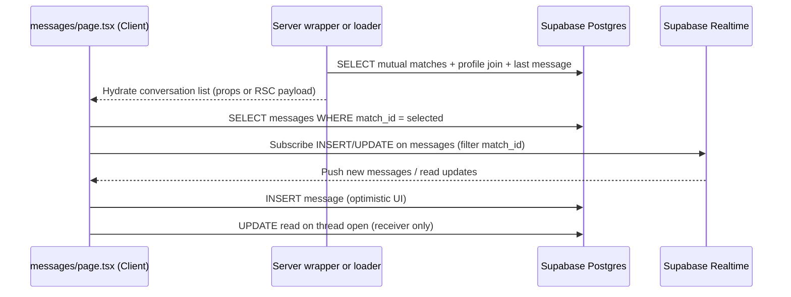

# Persistent Messaging — Feature Constitution

**Feature:** Persistent Messaging  
**Branch:** `20260629-013131-persistent-messaging`  
**Project:** International Rishta (Next.js 15 + Supabase)  
**Version:** 1.0.0 | **Ratified:** 2026-06-29 | **Last Amended:** 2026-06-29

This document is the **Laws of this Feature**. All spec, plan, and implementation work for
persistent messaging MUST comply. It supersedes ad-hoc decisions in `messages/page.tsx` mock
logic and README aspirational models where they conflict with `supabase/schema.sql`.

---

## 1. Feature Boundary

### 1.1 In scope

- Persist **text messages** between mutually matched users (`matches.is_match = true`).
- Conversation list derived from active matches plus last message preview and unread counts.
- Realtime delivery of new messages and read-state updates via Supabase Realtime.
- Auth-gated route at `/[locale]/messages` (existing locale prefix).
- Mark messages as read when the recipient views a thread.

### 1.2 Out of scope (deferred features)

- Voice messages, image/photo messages, and video calls (UI stubs remain; no backend wiring).
- `conversations` table from README guidance (not in `schema.sql`; do not invent without migration).
- Client-side E2E encryption (future); welcome/support thread for International Rishta Team
  (`id: "welcome"`) stays **client-only** and is never written to `public.messages`.
- Admin moderation UI, message search, and message deletion/editing.
- Pakistan-only geo restrictions at the messaging layer (handled elsewhere).

### 1.3 Product rule (non-negotiable)

**Text messaging between mutual matches is always free.** Premium gating applies only to
voice, image, and video surfaces already present in the UI.

---

## 2. Security First — Row Level Security (RLS)

RLS is the authoritative access control layer. The application MUST NOT rely on UI hiding alone.
All policies below apply to the `authenticated` role via `auth.uid()` (maps to `profiles.id`).

### 2.1 Tables governed by this feature

| Table | Role in messaging |
|-------|-------------------|
| `public.matches` | Gate: only mutual matches may message |
| `public.messages` | Message persistence and read state |
| `public.profiles` | Display names, photos for conversation list (read-only) |
| `public.photos` | Primary avatar for conversation list (read-only) |

### 2.2 `public.matches` — policies (existing + required)

**Existing (schema.sql):**

```sql
-- SELECT: participant may read their match rows
USING (auth.uid() = user_id OR auth.uid() = matched_user_id)

-- INSERT: user may create rows where they are user_id (discover/swipe — separate feature)
WITH CHECK (auth.uid() = user_id)
```

**Required amendment for messaging:**

- Application code MUST only open messaging UI for rows where `is_match = true`.
- RLS MUST add an explicit messaging read constraint (migration required before ship):

```sql
CREATE POLICY "Users can view mutual matches only for messaging context"
  ON public.matches FOR SELECT
  USING (
    (auth.uid() = user_id OR auth.uid() = matched_user_id)
    AND is_match = true
  );
```

If the above conflicts with discover needing pre-match rows, implement messaging queries
through a `SECURITY DEFINER` view or retain the broad SELECT policy and enforce `is_match`
in application queries — but **INSERT on messages MUST still verify mutual match in RLS**
(see §2.3).

### 2.3 `public.messages` — policies (existing + required)

**Existing (schema.sql):**

```sql
-- SELECT: sender or receiver
USING (auth.uid() = sender_id OR auth.uid() = receiver_id)

-- INSERT: sender must be authenticated user
WITH CHECK (auth.uid() = sender_id)
```

**Required policies (MUST ship with this feature):**

```sql
-- INSERT: mutual match, correct participants, sender is caller
CREATE POLICY "Users can send messages in mutual matches"
  ON public.messages FOR INSERT
  WITH CHECK (
    auth.uid() = sender_id
    AND sender_id <> receiver_id
    AND EXISTS (
      SELECT 1 FROM public.matches m
      WHERE m.id = match_id
        AND m.is_match = true
        AND (
          (m.user_id = sender_id AND m.matched_user_id = receiver_id)
          OR (m.user_id = receiver_id AND m.matched_user_id = sender_id)
        )
    )
  );

-- UPDATE: receiver may mark read only; no content mutation
CREATE POLICY "Receivers can mark messages read"
  ON public.messages FOR UPDATE
  USING (auth.uid() = receiver_id)
  WITH CHECK (
    auth.uid() = receiver_id
    AND read = true
  );

-- DELETE: denied (no policy = no access)
```

**Explicit denials:**

- No `DELETE` policy on `public.messages` (messages are immutable once sent).
- No `UPDATE` policy allowing `content`, `sender_id`, `receiver_id`, or `match_id` changes.
- `service_role` MUST NOT be exposed to the browser; use only
  `NEXT_PUBLIC_SUPABASE_ANON_KEY` in client code (`src/lib/supabase/client.ts`).

### 2.4 `public.profiles` and `public.photos` — read policies (existing)

Messaging MAY SELECT:

- `profiles` where `verified = true` (existing policy) for matched user display fields.
- `photos` for verified users (existing policy) for avatars.

Messaging MUST NOT expose unverified match partners through messaging-specific queries if
product rules require verified-only discovery (enforce in match list query filters).

### 2.5 Content protection (Phase B alignment)

- `messages.encrypted` defaults to `true` in schema; MVP stores plaintext `content` in Postgres
  with TLS in transit and Supabase at-rest encryption.
- **pgcrypto column encryption** for `content` is a follow-up migration; until then, the UI
  encryption note MUST use honest wording (transport + at-rest, not E2E) via i18n keys.
- Message `content` MUST be sanitized for display (no `dangerouslySetInnerHTML`).

### 2.6 Realtime authorization

- Enable Realtime on `public.messages` for `INSERT` and `UPDATE` events.
- Realtime filters MUST scope subscriptions per `match_id` (or per-user channel) so clients
  never subscribe to all messages globally.
- Realtime payloads inherit RLS; verify with anon + authenticated JWT in staging before deploy.

---

## 3. State Management — Data Flow

### 3.1 Supabase clients (mandatory split)

| Layer | Module | Responsibility |
|-------|--------|----------------|
| Browser | `src/lib/supabase/client.ts` → `createClient()` | Auth session, Realtime, optimistic sends, read updates |
| Server | `src/lib/supabase/server.ts` → `createClient()` | Initial SSR data fetch, no secrets beyond anon key + cookies |

**Law:** Do not import `client.ts` inside Server Components. Do not use `service_role` in
`src/` for this feature.

### 3.2 Route and auth gate

1. User navigates to `/[locale]/messages`.
2. Client Component (current pattern) calls `createClient().auth.getUser()`.
3. If no session → redirect to `/[locale]/auth/signin`.
4. If session → proceed to data load (do not duplicate middleware auth; follow discover/profile pattern).

### 3.3 Initial data load (server + client)

**Recommended flow (MUST implement):**



**Queries (conceptual):**

- **Conversation list:** `matches` where `is_match = true` and user is participant; join
  `profiles` + primary `photos`; aggregate last message via subquery or separate fetch ordered
  by `created_at DESC` per `match_id`.
- **Thread:** `messages` where `match_id = ?` order by `created_at ASC` limit paginated (e.g. 50,
  cursor on `created_at` for history).

Server-side initial fetch MAY live in:

- A thin Server Component parent that passes serialized data to the client page, OR
- Client-only fetch on mount if SSR is deferred — but Realtime subscription MUST attach after
  first successful thread load.

### 3.4 Realtime subscription rules

- One active channel per open thread (`match_id`).
- On thread switch: unsubscribe previous channel before subscribing to new `match_id`.
- On unmount: remove all channels.
- Handle `INSERT`: append if not duplicate (compare `id`).
- Handle `UPDATE`: merge `read` / `read_at` for receipts.
- On Realtime disconnect: show non-blocking i18n status; poll fallback optional (not required MVP).

### 3.5 Local state conventions

- `matches` / conversation list: derived from server data + Realtime updates to last message preview.
- `messages` / active thread: ordered array by `created_at`.
- `selectedMatch`: holds `match_id` (UUID), not mock string ids (`"1"`, `"welcome"` except welcome).
- Optimistic send: append pending message with temporary id; replace on INSERT success or roll back on error.
- Unread counts: compute from `read = false AND receiver_id = auth.uid()`; decrement on thread open.

### 3.6 Forbidden patterns

- Mock arrays (`mockMatches`, `mockMessages`, `welcomeThread` persisted to DB).
- `setTimeout` simulated replies.
- `Date.now().toString()` as permanent message ids.
- `toLocaleTimeString("en-US")` hardcoded — use locale-aware formatting (§4).
- Global Realtime subscription without `match_id` filter.

---

## 4. i18n & UI Laws

### 4.1 next-intl (mandatory)

- All user-visible strings MUST come from `next-intl`.
- Namespace: `common.messagesPage` (existing keys in `locales/en/common.json` and
  `locales/ur/common.json`); add new keys to **both** files in the same change.
- Client components: `useTranslations("common.messagesPage")` and `useLocale()`.
- ICU placeholders for counts and names: `{count}`, `{name}`.
- Error and empty states MUST be translated (no raw Supabase error text in UI).

### 4.2 RTL and Tailwind logical properties (mandatory)

Locale layout sets `dir` from `[locale]/layout.tsx`. Messaging UI MUST use logical utilities:

| Use | Class examples |
|-----|----------------|
| Horizontal padding | `ps-*`, `pe-*` (never `pl-*` / `pr-*` for directional layout) |
| Margin | `ms-*`, `me-*` |
| Text alignment | `text-start`, `text-end` |
| Position | `start-*`, `end-*` |
| Border accent | `border-s-*` (conversation selection indicator) |

**Law:** New messaging components MUST pass RTL review in `ur` locale before merge.

### 4.3 Time and formatting

- Timestamps: `Intl.DateTimeFormat(locale, { hour: "2-digit", minute: "2-digit" })` for relative
  times in thread; `Intl.RelativeTimeFormat` or date-fns with locale for "2m ago" patterns.
- Urdu numerals: follow project convention `ur-PK-u-nu-arabext` when displaying counts.

### 4.4 UI structure (preserve)

- Keep existing layout: sidebar conversation list + main chat panel + mobile toggle.
- Design tokens: `gold`, `teal`, `rounded-2xl`, `rounded-card` from `tailwind.config.ts`.
- Motion: Framer Motion for message enter animations (existing `AnimatePresence` pattern).
- Accessibility: `aria-label` on icon buttons via i18n; minimum touch targets `min-h-11`.

### 4.5 Premium UI stubs

- Voice, image, and video buttons MUST continue to route through `useSubscription` + paywall.
- This feature does not implement premium media backends; stubs MUST NOT call Supabase insert.

---

## 5. Data Model Contract (schema.sql)

Implement against the committed schema, not README aspirational tables.

### 5.1 `public.messages`

| Column | Usage |
|--------|--------|
| `id` | UUID primary key; client references for Realtime merge |
| `sender_id` | `auth.uid()` on insert |
| `receiver_id` | Other participant in mutual match |
| `match_id` | FK to `matches.id`; subscription filter key |
| `content` | Text body; max length enforced in app (recommend 2000 chars) |
| `encrypted` | Set `true`; pgcrypto migration later |
| `read` | `false` on send; updated by receiver |
| `read_at` | Set on read update |
| `created_at` | Ordering and pagination |

### 5.2 `public.matches`

| Column | Messaging rule |
|--------|----------------|
| `is_match` | MUST be `true` to message |
| `user_id`, `matched_user_id` | Participant pair |
| `matched_at` | Sort conversations |

### 5.3 Indexes (existing — MUST use in queries)

- `messages_sender_id_idx`, `messages_receiver_id_idx`
- `matches_user_id_idx`, `matches_matched_user_id_idx`

Add migration if needed: `(match_id, created_at DESC)` on `messages` for thread pagination.

---

## 6. Error Handling & Compliance

- Failed INSERT: show translated error; remove optimistic row; do not retry automatically.
- RLS violation: treat as permission error; never log message content to console in production.
- Rate limiting: recommend app-level throttle (e.g. 10 messages / 10s) before server abuse triggers.
- No PII in `console.log` (message bodies, phone numbers).

---

## 7. Testing & Verification Gates

Before merge to `develop`:

1. Two test users with `is_match = true` can exchange messages; non-match cannot INSERT (RLS).
2. Third user cannot SELECT either user's messages.
3. Receiver UPDATE sets `read` / `read_at`; sender cannot mark own messages read via API.
4. Realtime delivers message to open thread without full page refresh.
5. `/ur/messages` renders RTL layout with logical Tailwind classes.
6. All `messagesPage` strings exist in `en` and `ur`.
7. Welcome thread displays without database rows.

---

## 8. Governance

- Amendments to this constitution require a version bump and `LAST_AMENDED_DATE` update.
- **PATCH:** clarifications, query examples, non-behavioral edits.
- **MINOR:** new policies, new data flow stages, expanded scope (e.g. pgcrypto).
- **MAJOR:** scope removals, breaking RLS redefinitions, schema table renames.

Implementation PRs MUST link to this file and confirm §7 gates in the test plan.

---

## 9. Related Artifacts

| Artifact | Path |
|----------|------|
| Development context | `docs/initial-development-doc-001.md` |
| Base schema + RLS | `supabase/schema.sql` |
| Browser Supabase client | `src/lib/supabase/client.ts` |
| Current UI (to replace mocks) | `src/app/[locale]/messages/page.tsx` |
| Locale strings | `locales/en/common.json`, `locales/ur/common.json` |

---

*Suggested commit message:* `docs: add persistent-messaging feature constitution v1.0.0 (RLS, data flow, i18n laws)*
