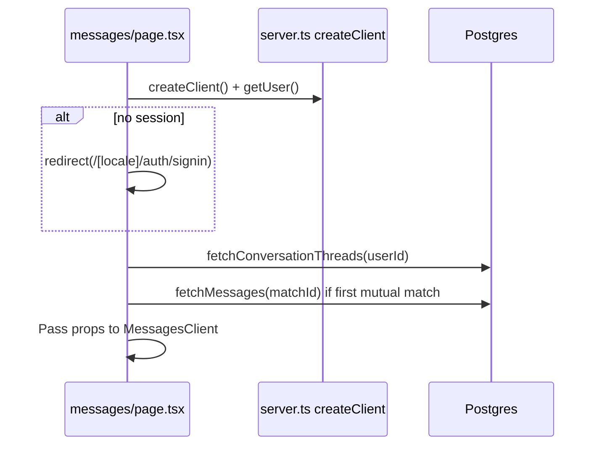

# Implementation Plan — Persistent Messaging

**Branch:** `20260629-013131-persistent-messaging`  
**Date:** 2026-06-29  
**Feature laws:** `.specify/persistent-messaging/constitution.md`  
**Specs dir:** `specs/20260629-013131-persistent-messaging/`

## Summary

Wire the existing `/[locale]/messages` UI to Supabase by (1) shipping a messaging RLS
migration, (2) splitting the route into a Server Component that prefetches conversation
threads and initial messages via `@supabase/ssr`, and (3) attaching scoped Realtime
subscriptions per active `match_id` on the client. Text messaging between mutual matches
remains free; premium voice/image/video controls stay as paywall stubs.

---

## Technical Context

| Item | Value |
|------|-------|
| Language | TypeScript 5.7 (strict) |
| Framework | Next.js 15 App Router (`src/app/[locale]/`) |
| Backend | Supabase (Postgres + Auth + Realtime) |
| Auth transport | `@supabase/ssr` — `client.ts` (browser), `server.ts` (RSC) |
| i18n | `next-intl` 3.4 — `locales/en`, `locales/ur` |
| Styling | Tailwind 3.4 + logical properties (`ps`/`pe`, `ms`/`me`) |
| Motion | Framer Motion (existing message animations) |
| Base schema | `supabase/schema.sql` |
| Payment migration | `supabase/COMPLETE_PAYMENT_ADMIN_MIGRATION.sql` (no messaging impact) |
| Testing | Manual constitution gates §7; no automated test suite yet |
| Performance | Thread list SSR < 200ms p95 on dev; Realtime delivery < 2s perceived |

---

## Constitution Check

| Gate | Status | Notes |
|------|--------|-------|
| Mutual-match-only messaging | ✅ Planned | RLS INSERT + query `is_match = true` |
| No `service_role` in browser | ✅ | Anon key only in `client.ts` |
| Server/client Supabase split | ✅ | `page.tsx` server; Realtime on client |
| next-intl all strings | ✅ | Extend `common.messagesPage` |
| Tailwind logical RTL | ✅ | Preserve existing classes; audit new code |
| Text free; premium media stubbed | ✅ | No voice/image INSERT |
| Welcome thread client-only | ✅ | Virtual `welcome` id |
| No mock persistence | ✅ | Remove mock arrays |
| Realtime scoped by `match_id` | ✅ | See §5 |
| Honest encryption UX | ✅ | i18n key update in plan |

**Gate result:** PASS — proceed to implementation.

---

## 1. Database Migration Layout

**File to create:** `supabase/messaging-rls-migration.sql`  
**Run after:** `schema.sql` (and payment migration if already applied)  
**Dashboard step:** Enable Realtime replication for `public.messages`.

```sql
-- =============================================================================
-- Persistent Messaging — RLS + Index + Realtime
-- Feature branch: 20260629-013131-persistent-messaging
-- Constitution: .specify/persistent-messaging/constitution.md
-- =============================================================================

BEGIN;

-- ---------------------------------------------------------------------------
-- 1. Performance index for thread pagination and last-message lookups
-- ---------------------------------------------------------------------------
CREATE INDEX IF NOT EXISTS messages_match_id_created_at_idx
  ON public.messages (match_id, created_at DESC);

-- ---------------------------------------------------------------------------
-- 2. Replace weak INSERT policy (permissive OR would bypass mutual-match check)
-- ---------------------------------------------------------------------------
DROP POLICY IF EXISTS "Users can send messages" ON public.messages;

CREATE POLICY "Users can send messages in mutual matches"
  ON public.messages
  FOR INSERT
  TO authenticated
  WITH CHECK (
    auth.uid() = sender_id
    AND sender_id IS DISTINCT FROM receiver_id
    AND EXISTS (
      SELECT 1
      FROM public.matches m
      WHERE m.id = match_id
        AND m.is_match = true
        AND (
          (m.user_id = sender_id AND m.matched_user_id = receiver_id)
          OR (m.user_id = receiver_id AND m.matched_user_id = sender_id)
        )
    )
  );

-- ---------------------------------------------------------------------------
-- 3. Receiver-only UPDATE for read receipts (no content mutation)
-- ---------------------------------------------------------------------------
DROP POLICY IF EXISTS "Receivers can mark messages read" ON public.messages;

CREATE POLICY "Receivers can mark messages read"
  ON public.messages
  FOR UPDATE
  TO authenticated
  USING (auth.uid() = receiver_id)
  WITH CHECK (
    auth.uid() = receiver_id
    AND read = true
  );

-- ---------------------------------------------------------------------------
-- 4. Explicit: no DELETE policy on messages (immutable once sent)
-- ---------------------------------------------------------------------------
-- Intentionally no DELETE policy — default deny.

-- ---------------------------------------------------------------------------
-- 5. Realtime publication (idempotent; ignore error if already added)
-- ---------------------------------------------------------------------------
DO $$
BEGIN
  ALTER PUBLICATION supabase_realtime ADD TABLE public.messages;
EXCEPTION
  WHEN duplicate_object THEN NULL;
END $$;

COMMIT;
```

### Policy notes

| Policy | Command | Rule |
|--------|---------|------|
| `Users can view own messages` | SELECT | Existing — `auth.uid()` is sender or receiver |
| `Users can send messages in mutual matches` | INSERT | New — mutual match + participant pair |
| `Receivers can mark messages read` | UPDATE | New — receiver only; `read = true` |
| *(none)* | DELETE | Denied |

**Matches table:** Retain existing broad SELECT for discover; messaging queries MUST filter
`is_match = true` in application SQL (see `research.md` R2).

---

## 2. Data-Fetching Pipeline (Next.js 15 + `@supabase/ssr`)

### 2.1 Route split (eliminates layout shift)

```text
src/app/[locale]/messages/
├── page.tsx           ← Server Component (NEW behavior)
└── MessagesClient.tsx ← Client Component (migrated from page.tsx)
```

**Current problem:** `page.tsx` is `"use client"` with `isCheckingAuth` spinner → mock data
pop-in causes layout shift.

**Target behavior:** Server resolves auth and data before HTML; client mounts with full
initial state — no data-loading spinner (only optional Realtime reconnect badge).

### 2.2 Server Component flow (`page.tsx`)



**Pseudocode (server):**

```typescript
// page.tsx — Server Component (no "use client")
import { redirect } from "next/navigation";
import { createClient } from "@/lib/supabase/server";
import { fetchConversationThreads, fetchThreadMessages } from "@/lib/messaging/queries";
import MessagesClient from "./MessagesClient";

export default async function MessagesPage({ params }: { params: Promise<{ locale: string }> }) {
  const { locale } = await params;
  const supabase = await createClient();
  const { data: { user } } = await supabase.auth.getUser();

  if (!user) {
    redirect(`/${locale}/auth/signin`);
  }

  const threads = await fetchConversationThreads(supabase, user.id);
  const firstMutualMatchId = threads[0]?.matchId ?? null;
  const initialMessages = firstMutualMatchId
    ? await fetchThreadMessages(supabase, firstMutualMatchId, { limit: 50 })
    : [];

  return (
    <MessagesClient
      locale={locale}
      userId={user.id}
      initialThreads={threads}
      initialMatchId={firstMutualMatchId}
      initialMessages={initialMessages}
    />
  );
}
```

### 2.3 Query helpers (`src/lib/messaging/queries.ts`)

Server-safe; accept Supabase client from either `server.ts` or `client.ts`.

**`fetchConversationThreads(supabase, userId)`**

1. **Matches** — `from("matches").select(...).eq("is_match", true).or(...)`  
2. **Peer profile** — join via embedded select:
   ```text
   id, user_id, matched_user_id, matched_at,
   user_profile:profiles!matches_user_id_fkey(full_name, city, date_of_birth),
   matched_profile:profiles!matches_matched_user_id_fkey(full_name, city, date_of_birth)
   ```
3. **Primary photo** — second query `photos` where `user_id IN (...)` and `is_primary = true`
   (or lowest `order_index`).
4. **Last message per match** — query `messages` where `match_id IN (...)` order
   `created_at DESC`, dedupe first per `match_id` in TS.
5. **Unread counts** — query `messages` where `receiver_id = userId`, `read = false`,
   group by `match_id`.

Map to `ConversationThread[]` sorted by `lastMessageAt ?? matched_at` DESC.

**`fetchThreadMessages(supabase, matchId, { limit, before? })`**

```text
from("messages")
  .select("id, sender_id, receiver_id, match_id, content, read, read_at, created_at")
  .eq("match_id", matchId)
  .order("created_at", { ascending: true })
  .limit(limit)
```

**`markThreadRead(supabase, matchId, userId)`** (client)

```text
update messages set read = true, read_at = now()
where match_id = matchId and receiver_id = userId and read = false
```

### 2.4 Server client cookie fix (`server.ts`)

Extend cookie adapter with `set` and `remove` per `@supabase/ssr` App Router docs so
`getUser()` and server queries receive refreshed sessions:

```typescript
cookies: {
  get(name) { return cookieStore.get(name)?.value; },
  set(name, value, options) { cookieStore.set({ name, value, ...options }); },
  remove(name, options) { cookieStore.set({ name, value: "", ...options }); },
}
```

### 2.5 Client hydration (`MessagesClient.tsx`)

| Prop | Client state seed |
|------|-------------------|
| `initialThreads` | `useState(initialThreads)` — prepend virtual welcome thread in client |
| `initialMatchId` | `selectedMatchId` — welcome if no mutual matches |
| `initialMessages` | `messages` map keyed by `matchId` |

On mount: **no** `getUser()` redirect (server already gated). Attach Realtime when user
selects a mutual match thread.

### 2.6 Layout-shift prevention checklist

- [ ] Remove `isCheckingAuth` loading UI for data path
- [ ] Server `redirect` before render when unauthenticated
- [ ] Sidebar renders with thread count on first paint
- [ ] Chat panel shows server-fetched messages for first match immediately
- [ ] Welcome thread injected client-side without empty flash

---

## 3. Realtime Mechanics

**Hook:** `src/hooks/useMessageRealtime.ts`  
**Consumer:** `MessagesClient.tsx`

### 3.1 Subscription lifecycle

```typescript
// useMessageRealtime.ts — conceptual contract (not application code yet)

function useMessageRealtime({
  matchId,        // null | "welcome" → no subscription
  userId,
  onInsert,
  onUpdate,
}: Options) {
  const supabase = createClient();
  const channelRef = useRef<ReturnType<typeof supabase.channel> | null>(null);

  useEffect(() => {
    // 1. Guard: welcome thread and null — no websocket
    if (!matchId || matchId === "welcome") {
      return;
    }

    // 2. Tear down previous channel before subscribing (match switch)
    if (channelRef.current) {
      supabase.removeChannel(channelRef.current);
      channelRef.current = null;
    }

    // 3. Create scoped channel
    const channel = supabase
      .channel(`messages:${matchId}`)
      .on(
        "postgres_changes",
        {
          event: "INSERT",
          schema: "public",
          table: "messages",
          filter: `match_id=eq.${matchId}`,
        },
        (payload) => onInsert(payload.new as MessageRow)
      )
      .on(
        "postgres_changes",
        {
          event: "UPDATE",
          schema: "public",
          table: "messages",
          filter: `match_id=eq.${matchId}`,
        },
        (payload) => onUpdate(payload.new as MessageRow)
      )
      .subscribe((status) => {
        if (status === "CHANNEL_ERROR") {
          // surface i18n reconnect hint (non-blocking)
        }
      });

    channelRef.current = channel;

    // 4. Cleanup on unmount or matchId change
    return () => {
      if (channelRef.current) {
        supabase.removeChannel(channelRef.current);
        channelRef.current = null;
      }
    };
  }, [matchId, userId]); // userId for stable auth context only
}
```

### 3.2 Event handlers (client)

| Event | Action |
|-------|--------|
| INSERT | If `payload.id` not in state → append; update sidebar last message + unread |
| INSERT (own, optimistic) | Skip duplicate when Realtime echoes optimistic row |
| UPDATE | Merge `read` / `read_at` into existing row by `id` |
| Thread switch | `removeChannel` → new `channel(\`messages:${newId}\`)` |
| Unmount | `removeChannel` all |

### 3.3 Send flow (optimistic)

1. Client appends optimistic row (`pendingId`).
2. `INSERT` via browser client.
3. On success: replace `pendingId` with server `id`.
4. On error: remove optimistic row; show `t("sendFailed")`.
5. Realtime INSERT from peer updates UI when other user sends.

### 3.4 Read receipts

On `handleSelectMatch(mutualMatch)`:

1. Load cached messages or `fetchThreadMessages` if not hydrated.
2. Call `markThreadRead`.
3. Local state: zero `unreadCount` for thread; set `read: true` on visible rows.

---

## 4. File Impact Matrix

### 4.1 Create

| File | Purpose |
|------|---------|
| `supabase/messaging-rls-migration.sql` | RLS policies, index, Realtime publication |
| `src/app/[locale]/messages/MessagesClient.tsx` | Client UI (from current `page.tsx`) |
| `src/lib/messaging/types.ts` | `ConversationThread`, `MessageRow`, DTO mappers |
| `src/lib/messaging/queries.ts` | `fetchConversationThreads`, `fetchThreadMessages`, `markThreadRead` |
| `src/lib/messaging/format.ts` | `formatMessageTime(locale, iso)`, `formatRelativeTime(locale, iso)` |
| `src/hooks/useMessageRealtime.ts` | Scoped channel lifecycle |
| `specs/20260629-013131-persistent-messaging/research.md` | Phase 0 decisions |
| `specs/20260629-013131-persistent-messaging/data-model.md` | Entity reference |
| `specs/20260629-013131-persistent-messaging/quickstart.md` | Dev verification |
| `specs/20260629-013131-persistent-messaging/contracts/messaging-ui.md` | UI/server prop contract |
| `.specify/persistent-messaging/plan.md` | This plan (feature-local copy) |

### 4.2 Modify

| File | Change |
|------|--------|
| `src/app/[locale]/messages/page.tsx` | Remove `"use client"`; server fetch + pass props; delete mocks |
| `src/lib/supabase/server.ts` | Add `set`/`remove` cookie handlers |
| `locales/en/common.json` | Add `messagesPage.*` keys: errors, welcome thread, honest encryption, relative time |
| `locales/ur/common.json` | Mirror all new `messagesPage` keys |
| `.cursor/rules/specify-rules.mdc` | Point SPECKIT marker to this plan |

### 4.3 Unchanged (explicit)

| File | Reason |
|------|--------|
| `src/lib/supabase/client.ts` | Already correct browser factory |
| `supabase/schema.sql` | Base schema unchanged; migration file additive |
| `supabase/COMPLETE_PAYMENT_ADMIN_MIGRATION.sql` | No messaging tables |
| `src/components/VideoCallModal.tsx` | Premium stub — no wiring |
| `src/components/SubscriptionPaywall.tsx` | Reused as-is |
| `src/hooks/useSubscription.ts` | Reused for premium gates |
| `src/components/Navigation.tsx` | No change |

### 4.4 Optional later (not MVP)

| File | Purpose |
|------|---------|
| `src/components/messaging/ConversationList.tsx` | Extract sidebar if `MessagesClient` > 400 lines |
| `src/components/messaging/MessageThread.tsx` | Extract chat panel |
| `supabase/messaging-rpc.sql` | `get_conversation_threads()` RPC if perf needs |

---

## 5. i18n Keys to Add

Namespace: `common.messagesPage` (both `locales/en/common.json` and `locales/ur/common.json`)

| Key | EN intent |
|-----|-----------|
| `sendFailed` | Generic send error |
| `loadFailed` | Thread load error |
| `emptyMatches` | No mutual matches yet |
| `emptyMatchesDesc` | CTA to discover |
| `welcomeName` | International Rishta Team |
| `welcomeCity` | Support |
| `welcomeMessage1` | Welcome greeting |
| `welcomeMessage2` | Profile completion hint |
| `encryptionNoteHonest` | Transport + at-rest (replaces overstated E2E) |
| `reconnecting` | Realtime disconnected hint |
| `justNow` | Relative time fallback |

Update `encryptionNote` or replace with `encryptionNoteHonest` per constitution §2.5.

---

## 6. Implementation Phases

| Phase | Work | Exit criteria |
|-------|------|---------------|
| **P0** | Apply `messaging-rls-migration.sql`; enable Realtime in dashboard | Policies visible; index exists |
| **P1** | `types.ts`, `queries.ts`, `server.ts` cookies | Server helpers return threads in Node |
| **P2** | Split `page.tsx` / `MessagesClient.tsx` | SSR list + messages; no mock data |
| **P3** | `useMessageRealtime.ts` + send/read | Live delivery; read receipts |
| **P4** | i18n + `format.ts` + RTL audit | `ur` locale pass |
| **P5** | Manual constitution §7 gates | All 7 checks green |

---

## 7. Risks & Mitigations

| Risk | Mitigation |
|------|------------|
| Weak INSERT policy OR bypass | DROP old policy before CREATE (§1 SQL) |
| Discover needs pre-match rows | No restrictive matches SELECT policy |
| Realtime not enabled | Dashboard replication + migration `ALTER PUBLICATION` |
| Server session stale | Cookie `set`/`remove` in `server.ts` |
| N+1 photo queries | Batch `IN` query for peer ids |
| Large `MessagesClient` | Optional component extraction in follow-up PR |

---

## 8. Generated Artifacts (Spec Kit)

| Artifact | Path |
|----------|------|
| Plan (this file) | `specs/20260629-013131-persistent-messaging/plan.md` |
| Plan (feature copy) | `.specify/persistent-messaging/plan.md` |
| Research | `specs/20260629-013131-persistent-messaging/research.md` |
| Data model | `specs/20260629-013131-persistent-messaging/data-model.md` |
| Quickstart | `specs/20260629-013131-persistent-messaging/quickstart.md` |
| UI contract | `specs/20260629-013131-persistent-messaging/contracts/messaging-ui.md` |
| Constitution | `.specify/persistent-messaging/constitution.md` |

**Next command:** `/speckit-tasks` to generate `tasks.md`.

**Suggested commit message:**

```text
docs: plan persistent messaging (RLS migration, SSR pipeline, Realtime lifecycle)
```
