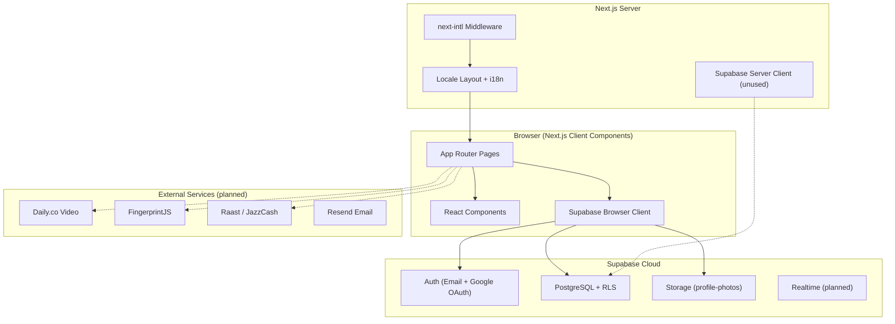
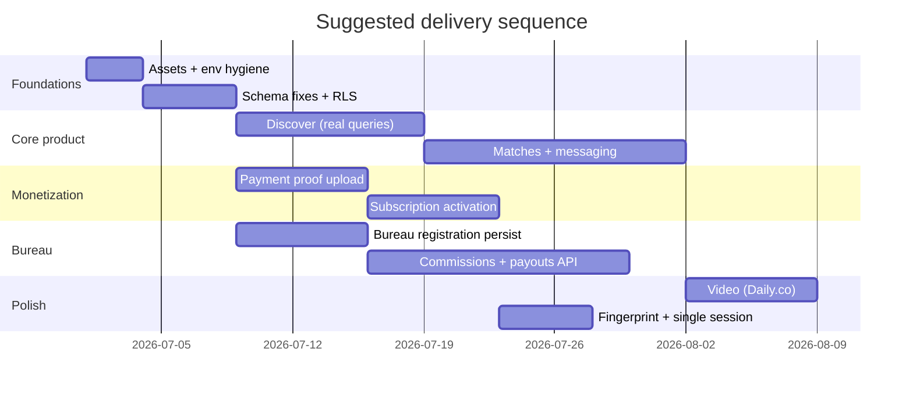

# International Rishta — Initial Development Document (001)

**Document ID:** `initial-development-doc-001`  
**Version:** 1.0.0  
**Date:** 2026-06-29  
**Branch at authoring:** `develop`  
**Status:** Living document — update as features ship

---

## 1. Executive Summary

International Rishta is a Pakistan-focused matrimonial platform built as a **Next.js 15** web application with **Supabase** as the backend (PostgreSQL, Auth, Storage, Realtime). The product targets verified profiles, bureau referrals, manual payment verification, bilingual UX (English/Urdu with RTL), and a premium subscription model.

The codebase is **past the marketing shell stage**: authentication, profile management, photo uploads, payment instructions, and an admin approval dashboard are wired to Supabase. Core product loops — real discovery/matching, persistent messaging, bureau registration, automated payments, and video calls — remain **partially implemented or mocked**.

This document defines the **current architecture**, **development workflow**, **implementation status**, and **recommended next steps** for engineers joining the project.

---

## 2. Product Scope (MVP)

| Domain | Goal |
|--------|------|
| Users | Sign up, complete profile, discover matches, message, subscribe |
| Verification | ID/face document upload; agent review |
| Bureau partners | City-licensed agents; referral codes; commissions |
| Payments | HBL/Raast manual proof → admin verification → account activation |
| Admin | Payment/bureau approval, capacity, analytics (planned) |
| i18n | English + Urdu (RTL); locale-prefixed routes |

Full product vision and pricing rules live in the root [`README.md`](../README.md).

---

## 3. Technology Stack

| Layer | Choice | Notes |
|-------|--------|-------|
| Framework | Next.js 15 (App Router) | `src/` directory, `@/*` alias |
| Language | TypeScript 5.7 | Strict mode |
| Styling | Tailwind CSS 3.4 | `tailwindcss-logical` for RTL |
| UI motion | Framer Motion, Lottie | Hero and micro-interactions |
| i18n | next-intl 3.4 | Locales: `en`, `ur` |
| Backend | Supabase | Auth, Postgres, Storage |
| Auth transport | `@supabase/ssr` | Browser client in use; server client defined but unused |
| Lint | ESLint 9 + eslint-config-next | `.eslintrc.json` |
| Deploy targets | Vercel (primary doc), cPanel/Passenger (README) | No `vercel.json` committed |

**Installed but not yet integrated in app code:** `@fingerprintjs/fingerprintjs`, `lenis`.

**Documented but not installed:** Shadcn UI.

---

## 4. High-Level Architecture



### 4.1 Request flow (locale-aware pages)

1. User hits `/` → middleware redirects to `/en` or `/ur`.
2. `[locale]/layout.tsx` loads messages, sets `dir`/`lang`, wraps with `NextIntlClientProvider`.
3. Client pages call `createBrowserClient()` for auth and data.
4. Protected routes (e.g. discover, profile) check session client-side and redirect to sign-in.

### 4.2 Admin flow (outside i18n)

1. User navigates to `/admin/dashboard`.
2. Page loads session via Supabase Auth.
3. Queries `admin_users` for role; non-admins redirect to `/en`.
4. Admin approves/rejects user payments and bureau applications against extended schema.

---

## 5. Repository Structure

```
internationalrishta/
├── docs/
│   ├── initial-development-doc-001.md    ← this document
│   └── old_implemented_docs/             ← legacy runbooks (reference only)
├── locales/
│   ├── en/common.json
│   └── ur/common.json
├── src/
│   ├── app/
│   │   ├── admin/                        ← non-localized admin shell
│   │   └── [locale]/                     ← all user-facing routes
│   ├── components/                       ← shared UI (28 components)
│   ├── hooks/useSubscription.ts
│   ├── i18n.ts
│   ├── lib/
│   │   ├── supabase/                     ← client, server, storage helpers
│   │   ├── formatters.ts
│   │   └── utils.ts
│   └── middleware.ts
├── supabase/
│   ├── schema.sql                        ← base schema
│   ├── user-payment-migration.sql
│   ├── bureau-approval-migration.sql
│   └── COMPLETE_PAYMENT_ADMIN_MIGRATION.sql
├── .env.local.example
├── next.config.js
├── tailwind.config.ts
└── package.json
```

**Missing from repo (expected locally):** `public/assets/` — logos, hero videos, Raast QR referenced in UI.

---

## 6. Routing Map

### User routes (`/[locale]/…`)

| Route | Purpose | Backend |
|-------|---------|---------|
| `/` | Landing, hero, pricing preview | Static + i18n |
| `/discover` | Swipe discovery | Auth gate; **mock profiles** |
| `/messages` | Chat UI | Auth gate; **mock threads** |
| `/profile` | Profile CRUD, photos | **Supabase** |
| `/pricing` | Plans comparison | Static |
| `/payment-instructions` | Manual payment steps | Reads profile |
| `/bureau` | Bureau landing + directory | **Mock directory** |
| `/bureau/register` | Multi-step registration UI | **No DB submit** |
| `/auth/signin`, `/signup`, `/reset` | Auth flows | Supabase (reset stub) |
| `/about`, `/contact`, `/terms`, … | Legal & info | i18n content |

### Admin routes

| Route | Purpose |
|-------|---------|
| `/admin/dashboard` | Payment + bureau approval |

Middleware matcher: `'/', '/(ur|en)/:path*'` — **`/admin` is not locale-prefixed**.

---

## 7. Data Model (Summary)

Base schema: `supabase/schema.sql`. Production admin/payment fields require **`COMPLETE_PAYMENT_ADMIN_MIGRATION.sql`** (run after base schema in Supabase SQL Editor).

### Core entities

| Table | Role |
|-------|------|
| `profiles` | User profile, subscription tier, verification, location (PostGIS) |
| `photos` | Profile media linked to Storage |
| `marriage_bureaus` | Licensed bureau partners |
| `matches`, `messages`, `video_calls` | Matching & comms (schema exists; app not wired) |
| `subscriptions`, `points_transactions`, `commission_payouts` | Billing & rewards |
| `payment_notifications`, `admin_users`, `bureau_notifications` | Admin workflow (migration) |

### Known schema notes

- Base `schema.sql` references `marriage_bureaus` before it is created in `profiles.referred_by_bureau_id` — fix order or run migrations only.
- Storage bucket in code: `profile-photos`; older docs mention `profiles` — align bucket name in Supabase dashboard.
- RLS: verify `INSERT` policy on `profiles` for signup upsert path.

---

## 8. Authentication & Authorization

| Mechanism | Status |
|-----------|--------|
| Email/password sign-up & sign-in | Implemented |
| Google OAuth | Implemented; callback on `/discover` |
| Password reset | UI stub only |
| Phone auth | Not implemented |
| Admin RBAC | `admin_users` table; roles: `super_admin`, `moderator`, `support` |
| Device fingerprint / single session | Dependency present; not wired |

**Session handling:** Client-side via `@supabase/ssr` browser client. No auth enforcement in middleware.

---

## 9. Internationalization Workflow

1. Add keys to `locales/en/common.json` and `locales/ur/common.json`.
2. Use `useTranslations('namespace')` in client components.
3. Layout sets `dir="rtl"` for `ur`; use logical Tailwind classes (`ps-*`, `pe-*`, `text-start`).
4. Fonts: Poppins (Latin), Noto Nastaliq Urdu (Urdu).

**Convention:** All new user-facing routes live under `src/app/[locale]/`.

---

## 10. Environment Configuration

Copy `.env.local.example` → `.env.local` and fill values:

| Variable | Required | Purpose |
|----------|----------|---------|
| `NEXT_PUBLIC_SUPABASE_URL` | Yes | Supabase project URL |
| `NEXT_PUBLIC_SUPABASE_ANON_KEY` | Yes | Public anon key |
| `SUPABASE_SERVICE_ROLE_KEY` | Server/admin | Not used in app code yet |
| `NEXT_PUBLIC_APP_URL` | Yes | OAuth redirect base |
| `NEXT_PUBLIC_DAILY_API_KEY` | Later | Video calls |
| `NEXT_PUBLIC_DAILY_DOMAIN` | Later | Daily.co room domain |
| `NEXT_PUBLIC_FINGERPRINTJS_PUBLIC_KEY` | Later | Trial abuse prevention |
| `NEXT_PUBLIC_RAAST_*`, `RAAST_WEBHOOK_SECRET` | Later | Payment automation |
| `RESEND_API_KEY` | Later | Transactional email |

**Security:** Replace any real keys in `.env.local.example` with placeholders before committing. Rotate keys that were ever committed in plain text.

---

## 11. Local Development Workflow

### Prerequisites

- Node.js 18+ (LTS recommended)
- npm
- Supabase project with migrations applied

### Setup

```bash
git clone <repo-url>
cd internationalrishta
cp .env.local.example .env.local
# Edit .env.local with Supabase keys and NEXT_PUBLIC_APP_URL=http://localhost:3000

npm install
npm run dev
```

Open [http://localhost:3000](http://localhost:3000) → redirects to `/en`.

### Supabase setup order

1. Run `supabase/schema.sql` (or fix table order first).
2. Run `supabase/COMPLETE_PAYMENT_ADMIN_MIGRATION.sql`.
3. Create Storage bucket **`profile-photos`** (public read as needed for profile images).
4. Enable Google provider in Supabase Auth; set redirect URLs.
5. Seed `admin_users` for your test account.

### Daily commands

| Command | Action |
|---------|--------|
| `npm run dev` | Dev server (port 3000 default) |
| `npm run build` | Production build |
| `npm run start` | Serve production build |
| `npm run lint` | ESLint |

### Branching (Spec Kit convention)

Feature work should use branches like `001-feature-name` or `YYYYMMDD-HHMMSS-feature-name`. Current default branch: `develop`.

---

## 12. Feature Implementation Matrix

| Feature | UI | Supabase | Notes |
|---------|:--:|:--------:|-------|
| Landing & marketing pages | ✅ | — | Missing `public/assets` media |
| i18n en/ur + RTL | ✅ | — | |
| Email + Google auth | ✅ | ✅ | |
| Profile edit | ✅ | ✅ | |
| Photo upload | ✅ | ✅ | Bucket: `profile-photos` |
| Discover / swipe | ✅ | ❌ | Mock data in `ProfileCards.tsx` |
| Messaging | ✅ | ❌ | Mock data |
| Video calls | ✅ | ❌ | Simulated modal; no Daily.co |
| Bureau directory | ✅ | ❌ | Mock data |
| Bureau registration | ✅ | ❌ | Form only |
| Payment instructions | ✅ | Partial | No proof upload to DB |
| Admin dashboard | ✅ | ✅ | Requires migration + admin row |
| Password reset | ✅ | ❌ | Stub |
| FingerprintJS | ❌ | ❌ | |
| API routes (cron/payouts) | ❌ | ❌ | Referenced in README only |
| Realtime presence | ❌ | ❌ | Planned |

---

## 13. Deployment Workflow

### Vercel (recommended in legacy docs)

1. Connect GitHub repo to Vercel.
2. Set all `NEXT_PUBLIC_*` and server env vars in project settings.
3. Build command: `npm run build`; output: Next.js default.
4. Point domain `internationalrishta.com`; enable HTTPS.

### cPanel / Passenger (alternative)

See [`README.md`](../README.md): upload project, `npm ci && npm run build`, start via `npm start` on port 3000, set env in cPanel Node app UI.

### Post-deploy checks

- [ ] OAuth redirect URLs include production domain
- [ ] Supabase RLS policies tested with anon + authenticated roles
- [ ] Storage CORS and bucket policies
- [ ] `NEXT_PUBLIC_APP_URL` matches canonical site URL

---

## 14. Recommended Implementation Phases

Aligned with README roadmap; ordered by dependency.



### Phase A — Stabilize (1 week)

- Add `public/assets/` or CDN URLs; fix 404 media.
- Fix schema ordering; align Storage bucket name.
- Add `profiles` INSERT RLS policy; test signup → profile flow.
- Sanitize `.env.local.example` (placeholders only).
- Wire password reset to Supabase.

### Phase B — Core loop (2–3 weeks)

- Replace mock discover with filtered Supabase queries.
- Persist swipes/matches; unlock messaging on mutual match.
- Supabase Realtime for messages; optional pgcrypto for content.

### Phase C — Payments (1–2 weeks)

- User payment proof upload → `payment_notifications`.
- Admin approval already exists; connect user submit path.
- Subscription tier activation on approval.

### Phase D — Bureau (1–2 weeks)

- Persist bureau registration; directory from `marriage_bureaus`.
- Referral code attribution on signup.

### Phase E — Hardening

- Server Supabase client for sensitive operations.
- FingerprintJS + trial limits.
- Daily.co integration for video unlock flow.
- API routes for weekly payouts (`/api/payouts/run-weekly`).

---

## 15. Code Conventions

- **Components:** PascalCase in `src/components/`; page-specific logic stays in `page.tsx` until reused.
- **Supabase:** Use `src/lib/supabase/client.ts` in client components; introduce server client for admin/cron when adding API routes.
- **Styling:** Tailwind + design tokens in `tailwind.config.ts` (`gold`, `teal`, `rounded-card`).
- **i18n:** No hardcoded user-facing strings in new code — add to both locale files.
- **Auth gates:** Follow discover/profile pattern: `getUser()` → redirect to `/[locale]/auth/signin`.

---

## 16. Ignore Files Reference

| File | Purpose |
|------|---------|
| [`.gitignore`](../.gitignore) | Git exclusions: deps, build, env, large media, keys |
| [`.cursorignore`](../.cursorignore) | Cursor indexing exclusions: reduce noise from `node_modules`, lockfiles, legacy docs |

---

## 17. Related Documentation

| Document | Location |
|----------|----------|
| MVP blueprint & pricing | [`README.md`](../README.md) |
| Supabase setup | [`supabase/README.md`](../supabase/README.md) |
| Deploy quick start | [`docs/old_implemented_docs/DEPLOY_QUICK_START.md`](old_implemented_docs/DEPLOY_QUICK_START.md) |
| Admin guide | [`docs/old_implemented_docs/ADMIN_GUIDE.md`](old_implemented_docs/ADMIN_GUIDE.md) |
| Payment admin setup | [`docs/old_implemented_docs/SETUP_PAYMENT_ADMIN.md`](old_implemented_docs/SETUP_PAYMENT_ADMIN.md) |

---

## 18. Open Questions / Decisions Needed

1. **Primary deploy target:** Vercel vs cPanel — affects cron and server-side jobs.
2. **Storage bucket name:** Standardize on `profile-photos` vs `profiles`.
3. **Free vs paid model:** Legacy docs mention free platform changes — confirm current pricing before wiring payments.
4. **Mobile app:** README outlines Expo/RN plan — out of scope for current web repo.
5. **Spec Kit workflow:** Constitution and feature specs not yet populated under `.specify/` — run `/speckit-constitution` and `/speckit-specify` when formalizing features.

---

## 19. Document History

| Version | Date | Author | Changes |
|---------|------|--------|---------|
| 1.0.0 | 2026-06-29 | Initial analysis | Architecture, workflow, status matrix, ignore file policy |

---

*For questions: info@internationalrishta.com — © International Rishta / IMJD Your Digital Media Partner*
